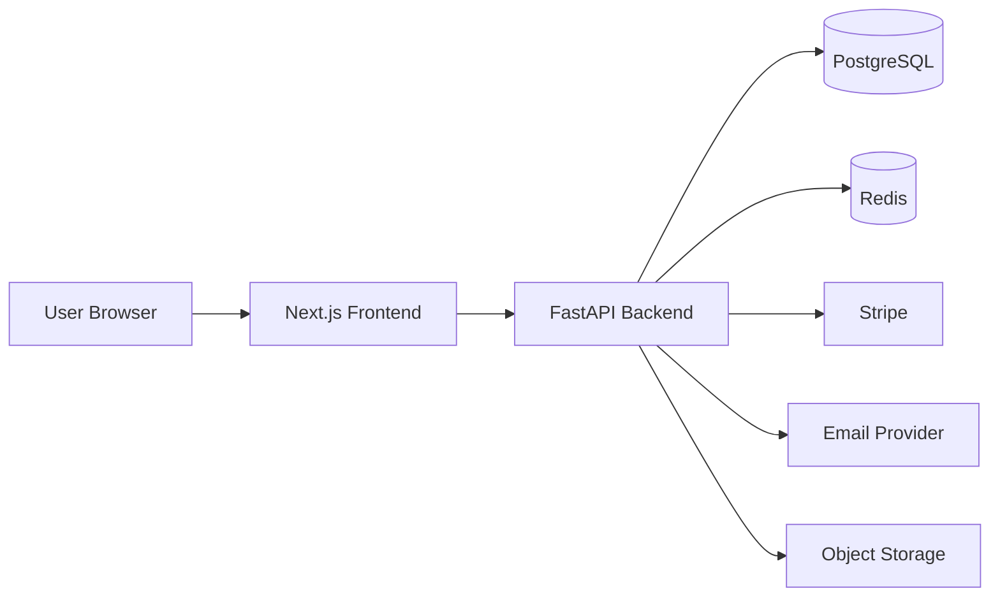
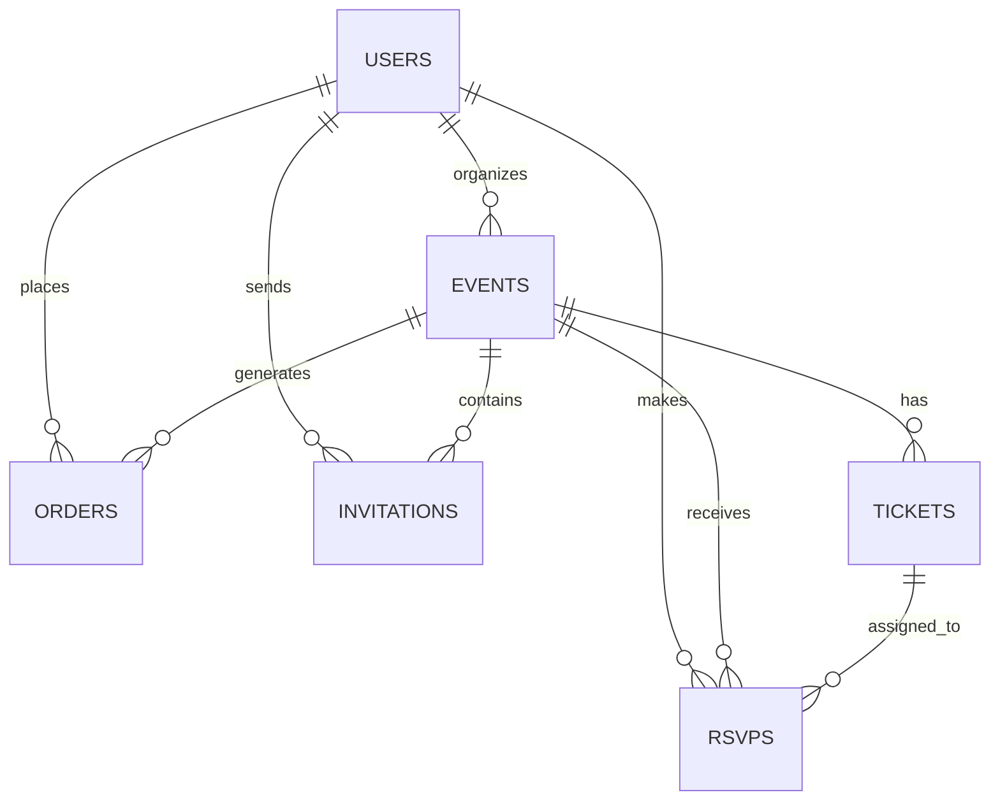

# Event Platform System Design

## 1. Product Definition

### Product Goal
Build a modern event platform for tech communities, colleges, and startups to create, publish, discover, and manage events with RSVP, ticketing, payments, and check-in support.

### Target Users
- Organizers: create and manage events, tickets, attendees, and analytics
- Attendees: discover events, RSVP, purchase tickets, and check in
- Admins: moderate content, manage users, and handle platform operations

### Core User Roles

#### Organizer
- Create, edit, publish, and delete events
- Create ticket types and manage capacity
- View RSVPs, attendees, and order status
- Export attendee data
- Scan or manually check in attendees

#### Attendee
- Sign up and log in
- Discover events
- RSVP for free events
- Buy paid tickets
- Receive email confirmations and reminders
- Present QR code for check-in

#### Admin
- Manage users, events, and reports
- Moderate event listings
- Resolve payment or access issues
- Review platform metrics

### MVP Scope

#### MVP Features
- Event creation and editing
- Event publishing workflow
- Public event page
- Event discovery feed
- Search and basic filters
- RSVP for free events
- Paid ticket purchase
- Ticket generation with QR code
- Email confirmations
- Organizer dashboard
- Basic admin panel

#### V2 Features
- Waitlist
- Approval-based registration
- Community chat
- Calendar sync
- AI recommendations
- Public API
- Mobile app
- Advanced analytics

### Priority List

#### P0
- Authentication
- Event CRUD
- Public event pages
- RSVP and ticketing
- Stripe payments
- Email notifications

#### P1
- Discovery feed
- Search and filters
- Organizer dashboard
- CSV export
- QR code check-in

#### P2
- Advanced analytics
- Waitlist
- Community/chat
- Calendar integrations
- Public API

---

## 2. System Architecture

### Recommended Stack
- Frontend: Next.js with React
- Backend: FastAPI
- Database: PostgreSQL
- Cache/queue: Redis
- File storage: S3-compatible object storage
- Email: Resend or SendGrid
- Payments: Stripe
- QR generation: server-side library

### Architecture Overview

### API Style
- REST API
- JSON request and response bodies
- Versioned routes under `/api/v1`
- OpenAPI documentation generated by FastAPI

### Key Backend Modules
- Auth service
- User service
- Event service
- Ticketing service
- RSVP service
- Order and payment service
- Notification service
- Admin service
- Check-in service

---

## 3. Database Design

### Core Tables

#### users
- id
- name
- email
- password_hash
- oauth_provider
- oauth_provider_id
- role
- email_verified_at
- created_at
- updated_at

#### events
- id
- organizer_id
- title
- slug
- description
- category
- location_type
- location_name
- location_address
- online_url
- start_at
- end_at
- timezone
- cover_image_url
- status
- capacity
- created_at
- updated_at

#### tickets
- id
- event_id
- name
- price_cents
- currency
- quantity_total
- quantity_sold
- sale_starts_at
- sale_ends_at
- is_active
- created_at
- updated_at

#### rsvps
- id
- event_id
- user_id
- ticket_id
- status
- qr_code_token
- checked_in_at
- created_at
- updated_at

#### orders
- id
- user_id
- event_id
- payment_provider
- provider_payment_id
- amount_cents
- currency
- status
- refunded_at
- created_at
- updated_at

#### invitations
- id
- event_id
- invited_by_user_id
- email
- user_id
- token
- status
- expires_at
- created_at
- updated_at

### Relationships

### Indexes
- users.email unique index
- events.organizer_id index
- events.status index
- events.start_at index
- events.slug unique index
- tickets.event_id index
- rsvps.event_id index
- rsvps.user_id unique composite index on `(event_id, user_id)`
- orders.user_id index
- orders.event_id index
- invitations.event_id index
- invitations.token unique index

### Constraints
- Foreign keys on all relational columns
- Unique event slug
- Unique user email
- Ticket quantity must be non-negative
- Event end time must be after start time
- RSVP count cannot exceed ticket or event capacity
- Paid ticket orders require successful payment status before ticket issuance

---

## 4. Authentication and Authorization

### Auth Methods
- Email and password
- OAuth login: Google first, then extend to GitHub or others
- Session-based auth for web or JWT for API usage

### Authorization Model
- Role-based access control
- Organizer can only manage own events
- Attendee can manage only own RSVPs and orders
- Admin can manage all resources

### Security Flows
- Signup and login
- Email verification
- Password reset
- Session refresh or JWT rotation
- Rate limiting on auth endpoints

---

## 5. Event Management

### Event Fields
- title
- description
- date/time
- timezone
- location type: online or offline
- location details
- cover image
- category
- capacity
- draft or published state

### Event API
- `POST /api/v1/events`
- `GET /api/v1/events`
- `GET /api/v1/events/{id}`
- `PATCH /api/v1/events/{id}`
- `DELETE /api/v1/events/{id}`
- `POST /api/v1/events/{id}/publish`
- `POST /api/v1/events/{id}/unpublish`

### Behavior
- Draft events are private and editable
- Published events appear in discovery
- Slug is generated from title and stabilized after publish
- Cover image upload is handled through pre-signed storage URLs

---

## 6. RSVP and Ticketing

### RSVP Flow
- Attendee opens event page
- Chooses free RSVP or ticket type
- System validates capacity and eligibility
- RSVP or ticket is created
- Confirmation email is sent

### Ticket Types
- Free
- Paid

### Ticket Rules
- Per-ticket quantity limits
- Event-wide capacity
- Optional approval workflow for selective events
- QR code generated per confirmed ticket or RSVP

### Ticketing APIs
- `POST /api/v1/events/{id}/rsvps`
- `POST /api/v1/events/{id}/tickets`
- `GET /api/v1/orders/{id}`
- `POST /api/v1/checkin/scan`

---

## 7. Payments

### Recommended Gateway
- Stripe

### Payment Flow
- Attendee selects a paid ticket
- Backend creates Stripe checkout session or payment intent
- Stripe webhook confirms payment
- Order status becomes paid
- Ticket or RSVP confirmation is issued

### Required Webhooks
- payment succeeded
- payment failed
- refund issued
- charge disputed

### Order States
- pending
- paid
- failed
- refunded
- canceled

---

## 8. Discovery

### Discovery Features
- Event feed
- Search by keyword
- Filter by date
- Filter by location
- Filter by category
- Featured or trending events

### Ranking Inputs
- Upcoming date
- RSVP count
- Recent engagement
- Featured flag

---

## 9. Invitations and Notifications

### Notification Types
- Event invite
- RSVP confirmation
- Ticket purchase confirmation
- Reminder email
- Check-in confirmation

### Delivery Tools
- Resend or SendGrid for email
- Background jobs for reminders and retries

---

## 10. Frontend Pages

### Pages
- Home / discovery
- Event details
- Create event
- Edit event
- Organizer dashboard
- User profile
- Login / signup
- Order confirmation

### UI Requirements
- Responsive layout
- Mobile-first event browsing
- Clean, modern event-focused design
- Clear CTA hierarchy for RSVP and ticket purchase

---

## 11. Organizer Dashboard

### Dashboard Features
- Attendee list
- CSV export
- RSVP count
- Ticket sales
- Views and conversion metrics
- Ticket management

---

## 12. Check-in System

### Check-in Methods
- QR code scanner
- Manual search and check-in

### Real-Time Behavior
- Checked-in state updates immediately
- Dashboard reflects current attendance

---

## 13. Deployment and Infra

### Frontend
- Deploy on Vercel

### Backend
- Deploy on Render or AWS

### Database
- Managed PostgreSQL

### Assets
- Store images in object storage
- Serve through CDN

### Operational Basics
- Environment variables for secrets
- Centralized logging
- Health checks
- Automated migrations

---

## 14. Testing

### Test Coverage
- Unit tests for business logic
- API tests for routes and permissions
- End-to-end tests for auth, event creation, RSVP, and payment flow
- Load tests for discovery and checkout hotspots

---

## 15. MVP Build Order

### Phase 1
- Project setup
- Auth
- User roles
- Database schema

### Phase 2
- Event CRUD
- Public event pages
- Publish workflow

### Phase 3
- RSVP and ticketing
- Stripe integration
- Email notifications

### Phase 4
- Discovery feed
- Search and filters
- Organizer dashboard

### Phase 5
- QR check-in
- Analytics
- Admin tools

---

## 16. V2 Roadmap

- Waitlists
- Approval-based registration
- Community chat
- Calendar sync
- AI event recommendations
- Public API
- React Native app

---

## 17. Implementation Notes

- Use UUID primary keys for all tables
- Store time in UTC and render in event timezone
- Keep event slugs immutable after publish
- Record audit logs for sensitive admin actions
- Separate read models for search and analytics later if scale requires it

