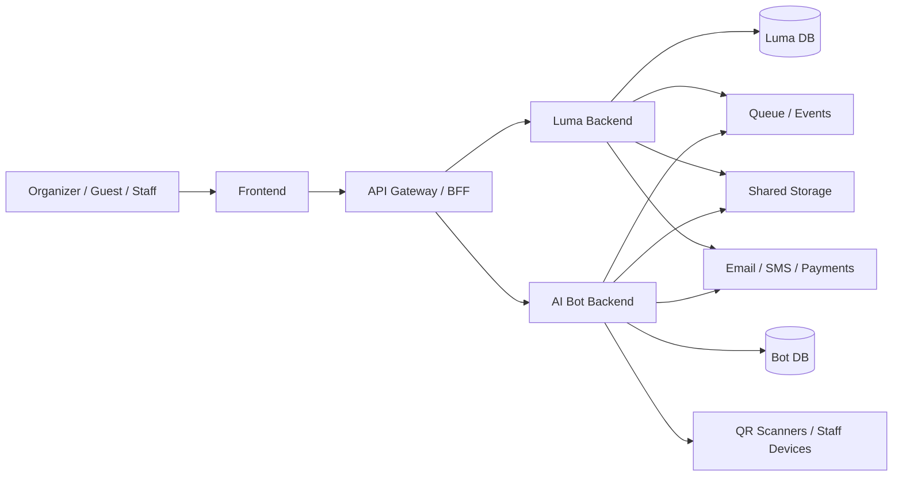

# Backend Architecture

## Overview

## Service Boundaries

### Luma

Owns the source of truth for:

- organizers and staff
- events
- registration forms
- registrations
- approvals and waitlists
- tickets and QR tokens
- payments and receipts
- reminders and notifications

### AI Bot

Owns operational event-time workflows:

- QR scan intake
- token validation requests
- door check-ins
- live attendee help
- incident tracking
- feedback capture
- event-time summaries

## Runtime Flow

### Before the event

1. Organizer creates an event in `Luma`.
2. Guest registers through the `Luma` public flow.
3. `Luma` approves or waitlists the registration.
4. `Luma` issues a ticket and QR token.
5. `Luma` sends confirmations and reminders.

### At the gate

1. Staff scans the QR code in the `AI Bot` app.
2. The bot sends the token to `Luma` for validation.
3. `Luma` returns the attendee and ticket status.
4. The bot writes the check-in record.
5. `Luma` remains the source of truth for ticket state.

### After the event

1. The bot sends or hosts the feedback flow.
2. Guest submits feedback.
3. The bot stores operational feedback data.
4. The summary is synchronized back to `Luma` analytics.

## Deployment Shape

- `luma-api`: main event backend
- `aibot-api`: event-time assistant backend
- `worker`: background jobs for notifications and exports
- `postgres`: persistent data store
- `redis`: queue, cache, and temporary scan/session state
- `object-storage`: QR assets, exports, and receipts

